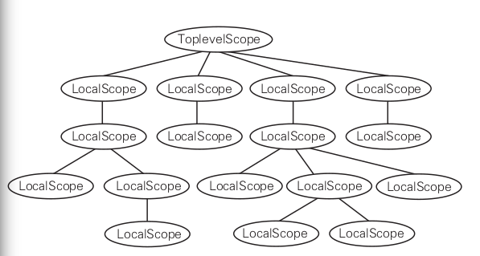

# 变量引用的消解

也就是变量的绑定，将引用的变量与其定义绑定起来。比如变量 i，可能是全局变量 i，也可能是静态变量 i，还可能是局部变量 i。这一步的操作，就是确定变量 i 将其与定义绑定起来。

cbc 中的变量，在头文件中都是变量或者函数的申明，为 `UndefinedVariable` 或者 `UndefinedFunction`，在源文件中的定义即为 `DefinedVariable` 或者 `DefinedFuntion`

## 符号表

cbc 中符号表的设计为 scope，也就是说变量与函数都是有作用域范围限定的。scope 为基类对象，派生类分别为 TopLevelScope 和 LocalScope。

前者表示全局作用域，后者表示局部作用域，通过 `parent` 指针，构成整个作用域树形结构。当需要查找某个变量的定义时，从当前作用域，一直往上查找，知道找到第一个定义时为止。

这种方式称为函数式的符号表，不破坏原有符号表的结构，而是重新生成一个新的符号表。通过 parent 指针，树形结构的方式，避免了每次都需要复制之前整个符号表的方式。
$$
\delta' = \delta + \{a \mapsto \tau \}
$$
按照函数式符号表的原则，每次新建的符号表，也就是作用域，都要复制原来符号表的数据，再加上当前作用域中的局部定义，此处通过 parent 指针实现。整个作用域树型结构如下所示



scope 采用的函数式符号表的方式，应用树形结构实现，这里的释放可能有点问题，还是需要采用 tracker 的方法，暂时没有处理，后续在做处理。

## import files 的处理

有几个问题需要解决

1. import/include 循环引用的问题如何解决
2. ~~记录文件出现的位置 location~~
3. 在从 cb 源文件中获取 ast 后再统一处理 import 的文件

## ~~记录文件的位置~~

在 ast 中，设计 import file 的数据结构，单独创建一个管理类，如下所示

```
class ImportFile {
public:
private:
	std::string file_name_;
	ast::Location* location_;
}
```

## import 的循环引用

直接解决循环引用的问题。每次在处理 import 文件的时候，将处理过的文件都放在一个 map 中，

```
std::map<std::string, ast::Declarations> ImportMap;
```

每次处理一个新文件时，优先从 map 中进行查找，如果存在，说明之前已经处理过该头文件，就跳过处理下一个，直到所有的头文件都处理完，那么 map 中所有的 `ast::Declarations` 就是当前源文件需要的申明。全部加入到 ast 中。

这样，就不需要考虑循环引用的问题。

也就是每次计算出的所有申明，都是针对当前源文件的。但是如果其他源文件也有类似的申明时，需要重新计算。

## 函数调用的处理方式

在语法文件中，如下所示的部分，表示的是表达式的一部分

```g4
postfix
    : primary postfix_option*
    ;

postfix_option
    : PLUS PLUS               // a++
    | MINUS MINUS             // a--
    | LBRACKET expr RBRACKET  // [a]
    | PERIOD memb1=name             // .a
    | POINTER_REF memb2=name        // ->a
    | LPAREN args? RPAREN      // (a, b, c)
    ;

primary
    : INTEGER
    | HEX
    | OCT
    | S_CHARACTER
    | S_STRING
    | IDENTIFIER
    | LPAREN expr RPAREN
    ;
```

postfix 规则中，右边非终结符部分，primary 如果是标识符，在 ast 中对应的节点是 `VariableNode` 节点，同时当 `postfix_option` 规则是 `LPAREN args? RPAREN` 表示函数参数，也就是说，当一个语句是函数调用时，比如

```
printf("Hello, World!\n");
```

其 ast 结构如下所示

```
<<ExprStmtNode>> (hello.cb, line 6, column 4)
      expr: 
        <<FunctioncallNode>> (hello.cb, line 6, column 4)
        Expr: 
          <<VariableNode>> (hello.cb, line 6, column 4)
          name: printf
        Arguments:
          <<StringLiteralNode>> (hello.cb, line 6, column 11)
          Value: "Hello, World!\n"
```

**也就是说，函数名也是变量的一种，上面函数调用这个表达式，表示调用变量 printf 所指向的函数，因此只要确定变量 printf 所指向的对象，需要调用的函数也就确定了。**

# 类型名称的消解

cbc 的基础类型如下

```
VOID
CHAR
SHORT
INT
LONG
UNSIGNED CHAR
UNSIGNED SHORT
UNSIGNED INT
UNSIGNED LONG
```

**bool 类型暂时没有加入**

类型名称的消解，主要是将 TypeRef 全部变成 Type。在构建ast时，所有的类型都是当作 TypeRef 来进行处理的，记录的是类型的名称以及位置信息，在变量消解完之后，需要将所有的 TypeRef 转换成对应类型具体的定义信息，即 Type